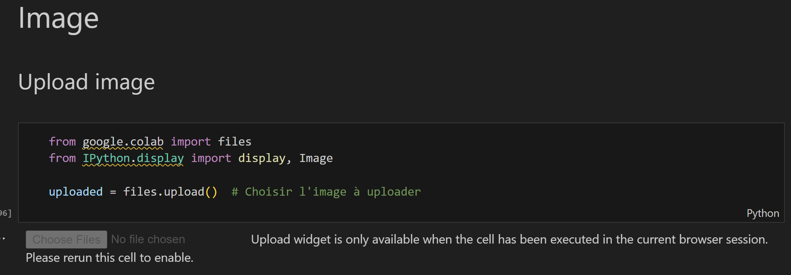
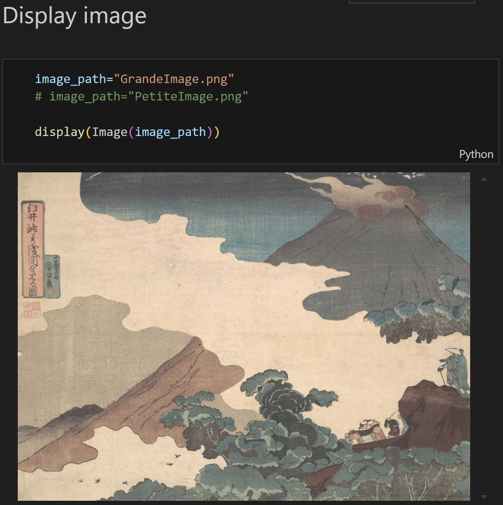

  <h2>Tatouage d'images chiffrées homomorphiquement</h2>
  

Participants au projet:

- Tom ABBOUZ
- Galien RICHARDEAU

Enseignants:

- Reda BELLAFQIRA
- Chloé BERTON

## Introduction

Ce projet propose une méthode de tatouage sécurisée permettant d'insérer une marque à la fois dans le domaine clair et dans le domaine chiffré homomorphiquement.

En associant l'algorithme de tatouage QIM (Quantization Index Modulation) décrite dans [le guide d'implémentation](articles/Projet_HE_WAT_2024.pdf)
et le crypto-système de Paillier, nous sommes parvenus à mettre en oeuvre une méthode de tatouage dont les processus de chiffrage et déchiffrage sont totalement indépendants de l'intégration/extraction du message. Par ailleurs, il n'est pas nécessaire de connaître la clé de (dé)chiffrement pour dissimuler un message dans l'image chiffrée.

Enfin, cette méthode garantit une distorsion minimale de l'image tout en offrant une capacité élevée pouvant prendre en charge différents objectifs de sécurité basés sur le filigrane.

## Fonctionnalités principales

- Chiffrement homomorphique d'images avec le cryptosystème de Paillier
- Insertion d'un tatouage dans les domaines chiffrés et clairs
- Extraction du tatouage dans les deux domaines
- Comparaison de l'image originale, après sa conversion en niveau de gris, et de l'image reconstruite (incluant la marque) après déchiffrement
- Gestion des débordements de pixels (valeurs >255)

## Utilisation

1. Ouvrir le fichier [TatouageRendu.ipynb](TatouageRendu.ipynb) dans Google Colab.
2. Dans la cellule suivante, exécutez le code et cliquez sur **choose files** pour sélectionner l'image à tatouer. Nous vous proposons d'utiliser
   [PetiteImage.png](PetiteImage.png) pour une exécuter le flux complet en moins d'une minute, ou l'image [GrandeImage.png](GrandeImage.png) (~14 minutes sur Google Colab).
   

3. Exécutez la cellule suivante afin de vous assurez que l'image puisse être lue correctement.
  

4. Enfin, exécutez toutes les cellules du notebook pour réaliser le tatouage de l'image. Les résultats seront affichés à la fin du notebook, dans la section **Actions**.

## Variables de la classe ImplementTatoo

- `Iv_pre` : image pré-marquée (après insertion de la pré-marque avec la technique QIM)
- `Iv_pre_enc` : version chiffrée de `Iv_pre`
- `Iv_pre_enc_ins1` : image après insertion de la marque insérée dans le domaine en clair = `Iv_pre_enc` + addition homomorphe de la marque
- `Iv_pre_enc_ins1_ins2` : image après insertion de la marque dans le domaine chiffré = `Iv_pre_enc_ins1` + insertion probabiliste de la marque
- `Iv_decrypted` : version déchiffrée de `Iv_pre_enc_ins1_ins2`

## Structure du code

### Installation of conda and Gmpy2

Cette section du code installe les dépendances nécessaires pour:

1. manipuler des entiers de grande taille ;
2. exécuter le programme sur Google Colab.

### Paillier implementation with Gmpy2 from TP

- Importation des paquets requis
- Génération de nombres premiers
- Génération des clés publique et privée de Paillier
- Fonction de chiffrement
- Fonction de déchiffrement optimisée avec le CRT (Théorème Chinois des Restes)

### Compute mark size

La taille du message (ou marque), identique à celle des blocs de tatouage, correspond au plus petit diviseur supérieur à 8 divisant le nombre total de pixels dans l'image.
L'idée est de s'assurer que la taille de la marque est suffisamment grande pour permettre une insertion efficace tout en préservant l'intégrité visuelle de l'image.

### Blocks cut

Après avoir converti l'image en une liste de pixels représentant des niveaux de gris, cette étape découpe cette liste en sous-listes de tailles identiques à celle de la marque. Chacune de ses sous-listes représente un bloc d'image dans lequel le tatouage sera inséré.

### Premark

Cette section contient deux fonctions:

1. `QIM_tatoo` implémente la technique de tatouage QIM. Elle prend en entrée une valeur de pixel (0-255), un bit de marquage (0 ou 1) et un pas de quantification. Cette méthode modifie subtilement la valeur du pixel pour y encoder le bit de marquage, tout en préservant la qualité visuelle de l'image.

2. `insert_mark_with_QIM` applique la technique QIM pour insérer un marquage à un bloc entier de l'image. Elle utilise la fonction `QIM_tatoo` pour chaque pixel du bloc, insérant ainsi la marque complète dans le bloc.

### Block encryption/decryption

- Block encryption
- Block decryption
- XOR

### Classe d'implémentation

La classe `ImplementTatoo` gère l'ensemble du processus de tatouage. Elle est initialisée avec les paramètres de l'image (hauteur, largeur, pas de quantification) et contient plusieurs méthodes pour:

- Insérer la pré-marque dans le domaine clair
- Chiffrer les blocs d'image
- Insérer la marque dans le domaine chiffré
- Déchiffrer les blocs d'image
- Vérifier l'extraction de la marque dans les deux domaines (clair et chiffré)
- Reconstruire l'image (incluant la marque) à partir des blocs déchiffrés

Lors de l'initialisation de la classe, plusieurs étapes sont effectuées:

1. Découpage de l'image en bloc
2. Génération de la marque aléatoirement
3. Génération des clés
4. Chiffrement de b_message
5. Initialisation des différents états de Iv
6. Initialisation de la liste pour reconstruire l'image
7. Prétraitement des données

La classe comprend également des méthodes pour afficher les vecteurs de données, traiter l'image, reconstruire l'image et comparer les images.

- `print_marks()`: Affiche les marques de tatouage
- `insert_premark()`: Insère la pré-marque dans le domaine clair
- `pretreatement()`: Prétraite l'image pour l'insertion de la marque (chiffrement du Iv pre-marqué)
- `clair_insertion()`
- `ciphered_insertion()`
- `decrypt_Iv()`
- `check_ciphered_extract()`: Vérifie que la marque peut être extraite de chaque bloc chiffré
- `check_clair_extract()`: Vérifie que la marque peut être extraite de chaque bloc déchiffré
- `reconstruct_list()`: Reconstruit la liste en vue d'afficher de nouveau l'image

### Demo

Cette section comporte les fonctions nécessaires pour réaliser une démonstration complète du système de tatouage à partir d'une image sur son poste personnel depuis Google Colab.

Elle inclut des fonctions pour:

- Afficher les vecteurs de données de façon lisible
- Charger une image depuis Google Colab
- Traiter l'image (conversion en niveaux de gris)
- Afficher l'image
- Reconstruire l'image à partir des blocs déchiffrés
- Comparer l'image originale et l'image reconstruite avec la marque

### Actions

Flux complet de démonstration:

1. Conversion d'une image en niveaux de gris et en vecteur de pixels
2. Initialisation du système de tatouage
3. Insertion de la pré-marque
4. Chiffrement Paillier des blocs : fin du prétraitement
5. Insertion homomorphique de la marque finale dans le domaine en clair, puis dans le domaine chiffré
6. Extraction et vérification de la marque dans le domaine chiffré
7. Déchiffrement des blocs d'image, extraction et vérification de la marque dans le domaine clair
8. Reconstruction et affichage de l'image avec la marque
9. Comparaison de l'image originale et de l'image reconstruite avec la marque
